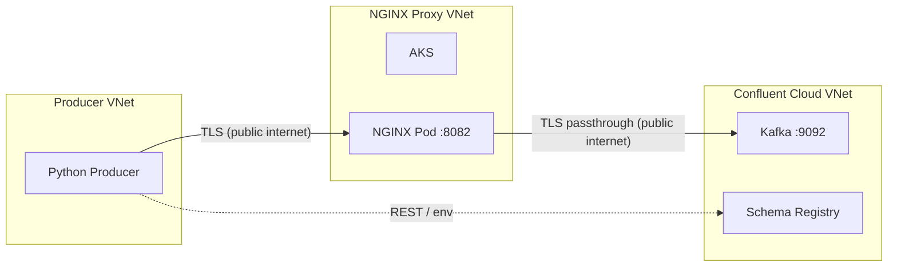

# cursor-nginx-proxy

End-to-end Terraform and Python for a **Python Kafka Producer** that sends sample data to a Confluent Cloud Kafka topic (with Schema Registry), via an **NGINX TCP proxy** (SSL passthrough) on Azure Kubernetes Service (AKS). All infrastructure is in Azure; Confluent Cloud runs in its own VNet. Every Azure resource is tagged with **environment** and **owner_email** (see [Required: GitHub setup](#required-github-setup-for-ci-and-tagging) and [spec](spec_nginx_proxy.md)).

**Full specification:** [spec_nginx_proxy.md](spec_nginx_proxy.md).

## Architecture

- **Producer VNet** (Azure) → TLS over public internet → **NGINX VNet** (AKS, NGINX listening on **8082**) → TLS passthrough over public internet → **Confluent Cloud** (Kafka **9092**, Schema Registry).
- All Confluent and Terraform resources use the prefix `cjackson-` (configurable).

**Mermaid (raw):** [docs/architecture.mmd](docs/architecture.mmd)



**Excalidraw:** [docs/architecture.excalidraw](docs/architecture.excalidraw) — open in [Excalidraw](https://excalidraw.com) to view or edit.

## Prerequisites

- **Terraform** (>= 1.0)
- **Azure CLI** (`az login`, subscription set)
- **kubectl** (for NGINX/Kubernetes)
- **Confluent CLI** (optional, for monitoring)
- **Python 3.9+** (for the Producer)

## Required: GitHub setup (for CI and tagging)

All Azure resources are tagged with `environment` and `owner_email`. Configure GitHub once so Terraform and CI use them.

### 1. GitHub Secrets (required for Terraform plan/apply in CI)

Store the **Confluent Cloud** API key and secret so Terraform can manage Confluent resources:

- **CONFLUENT_CLOUD_API_KEY** — Confluent Cloud API key (Cloud API keys in Confluent Cloud console).
- **CONFLUENT_CLOUD_API_SECRET** — Confluent Cloud API secret.

Also add Azure credentials if CI runs Terraform plan/apply:

- **AZURE_SUBSCRIPTION_ID**, **AZURE_TENANT_ID**, **AZURE_CLIENT_ID**, **AZURE_CLIENT_SECRET** (or equivalent).

Repo path: **Settings → Secrets and variables → Actions** (or **Environments → [environment] → Secrets**).

### 2. GitHub Environment and `owner_email` (required for Azure tags)

Create a GitHub **Environment** (e.g. `terraform`) and set **Environment variables** (not secrets) so every Azure resource gets the correct tags:

- **OWNER_EMAIL** — Your email (e.g. `your_email@example.com`). Used as the `owner_email` tag on all Azure resources. Set this once; CI and Terraform will use it.
- **ENVIRONMENT** (optional) — Name for the deployment (e.g. `dev`, `staging`, `prod`). Defaults to `dev` if unset.

Repo path: **Settings → Environments → Add environment** (e.g. `terraform`) → **Environment variables** → add `OWNER_EMAIL` and optionally `ENVIRONMENT`.

For local runs, set `TF_VAR_owner_email` and optionally `TF_VAR_environment` (e.g. `export TF_VAR_owner_email=your_email@example.com`).

## Terraform deploy and update

Credentials can be provided via variables or environment variables.

1. **Confluent Cloud:** Required for the provider and for Kafka ACL creation (Basic cluster needs ALTER). Use GitHub Secrets in CI, or locally pass as Terraform variables so the Confluent module receives them:
   - `export TF_VAR_confluent_cloud_api_key="$CONFLUENT_CLOUD_API_KEY"` and `export TF_VAR_confluent_cloud_api_secret="$CONFLUENT_CLOUD_API_SECRET"` (if you already have the env vars set), or  
   - `-var="confluent_cloud_api_key=..."` and `-var="confluent_cloud_api_secret=..."`, or a non-committed `.tfvars` file.

2. **Azure:** Set subscription and tenant, e.g.:
   - `export ARM_SUBSCRIPTION_ID="..."` and `ARM_TENANT_ID="..."`, or  
   - Use `terraform.tfvars` (do not commit) or `-var` for `azure_subscription_id` and `azure_tenant_id`.

3. **Tags (required):** Set `owner_email` (and optionally `environment`):
   - From GitHub: use Environment `terraform` with variable **OWNER_EMAIL** (and **ENVIRONMENT**).
   - Locally: `export TF_VAR_owner_email=your_email@example.com` and optionally `TF_VAR_environment=dev`.

4. **GitHub (optional):** To push secrets to the repo, set `GITHUB_TOKEN` or variable `github_token`, and `github_owner` / `github_repo` (default `cursor-nginx-proxy`).

### Confluent Cloud – Stream Governance (Schema Registry)

Schema Registry uses the **ESSENTIALS** package for Stream Governance. The Confluent Terraform provider does not create the Schema Registry cluster; it only looks up an existing one. Before running `terraform apply`, enable Stream Governance for your Confluent Cloud environment:

1. In Confluent Cloud, open the environment (e.g. `cjackson-environment` after the first apply that creates it, or create the environment and enable governance before a full apply).
2. **Enable Stream Governance** with the **ESSENTIALS** package (Stream Governance → Enable, or Set up Schema Registry). One Schema Registry cluster per environment will be created.
3. Re-run `terraform apply` so the Terraform data source can find the Schema Registry cluster and populate outputs (e.g. `schema_registry_url`) and role bindings.

Basic Kafka clusters use ACLs (managed by Terraform); creating ACLs requires the Confluent Cloud API key (ALTER permission), so you must pass `confluent_cloud_api_key` and `confluent_cloud_api_secret` as Terraform variables (e.g. via `TF_VAR_*`). RBAC resource roles for Kafka require Standard (or higher) if you upgrade later.

**Deploy:**

```bash
cd terraform
terraform init
terraform plan -out=tfplan
terraform apply tfplan
```

**Update:** Run `terraform plan` and `terraform apply` again. Re-apply after the NGINX Load Balancer is ready so that `nginx_bootstrap_servers` and GitHub secrets (if used) get the correct LB address.

**Example variable overrides (do not commit secrets):**

```bash
terraform plan \
  -var="azure_subscription_id=..." \
  -var="azure_tenant_id=..." \
  -var="owner_email=your_email@example.com" \
  -var="environment=dev" \
  -var="confluent_cloud_api_key=..." \
  -var="confluent_cloud_api_secret=..." \
  -var="github_owner=YOUR_ORG" \
  -var="github_token=..."
```

## Running the Producer

The Producer reads **BOOTSTRAP_SERVERS** (NGINX LB:8082), **SCHEMA_REGISTRY_URL**, **KAFKA_API_KEY**, **KAFKA_API_SECRET**, and **TOPIC** from the environment (or a local `.env` file). These can come from Terraform outputs or GitHub Secrets.

**From Terraform outputs (after apply):**

```bash
export BOOTSTRAP_SERVERS="$(terraform -chdir=terraform output -raw nginx_bootstrap_servers)"
export SCHEMA_REGISTRY_URL="$(terraform -chdir=terraform output -raw schema_registry_url)"
export KAFKA_API_KEY="$(terraform -chdir=terraform output -raw kafka_api_key_id)"
export KAFKA_API_SECRET="$(terraform -chdir=terraform output -raw kafka_api_key_secret)"
export TOPIC="$(terraform -chdir=terraform output -raw topic_name)"
cd producer && pip install -r requirements.txt && python producer.py
```

**Using a local `.env`:** Copy `producer/.env.example` to `producer/.env`, fill in values (from outputs or GitHub Secrets), then:

```bash
cd producer
pip install -r requirements.txt
python producer.py
```

**Required env vars:** `BOOTSTRAP_SERVERS`, `SCHEMA_REGISTRY_URL`, `KAFKA_API_KEY`, `KAFKA_API_SECRET`, `TOPIC`. See [docs/env-variables.md](docs/env-variables.md).

## GitHub Secrets (Producer and workflows)

When Terraform runs with a GitHub token, it creates or updates these **repository secrets** (visible to repo admins):

- **BOOTSTRAP_SERVERS** — NGINX LB host:8082  
- **SCHEMA_REGISTRY_URL** — Confluent Schema Registry URL  
- **KAFKA_API_KEY** — Kafka API key ID  
- **KAFKA_API_SECRET** — Kafka API secret  
- **TOPIC** — Kafka topic name  

Use these in GitHub Actions or locally (e.g. `${{ secrets.BOOTSTRAP_SERVERS }}` in workflows, or copy into `.env` for local runs).

## Confluent CLI – monitor and test

After logging in and selecting the correct environment/cluster:

```bash
# Login (browser or service account)
confluent login

# List environments and clusters
confluent environment list
confluent kafka cluster list

# List topics and consume (replace cluster-id and topic name from Terraform outputs)
confluent kafka topic list --cluster <cluster-id>
confluent kafka topic consume cjackson-sample-topic --cluster <cluster-id> --from-beginning

# Schema Registry (replace SR endpoint from Terraform output)
confluent schema-registry subject list --url <schema-registry-url>
confluent schema-registry subject describe <subject> --url <schema-registry-url>
```

Get cluster ID and Schema Registry URL from Terraform:

```bash
terraform -chdir=terraform output schema_registry_url
terraform -chdir=terraform output kafka_bootstrap_endpoint
```

## NGINX and Kubernetes

**Load Balancer and NGINX service:**

```bash
kubectl get svc -n cjackson-nginx
# Note the EXTERNAL-IP or hostname for the nginx-lb service (port 8082)
```

**NGINX pod logs:**

```bash
kubectl logs -n cjackson-nginx -l app=nginx -f
```

**Inspect NGINX config inside the pod:**

```bash
kubectl exec -n cjackson-nginx deploy/nginx -- cat /etc/nginx/nginx.conf
```

**Verify TCP flow:** The stream block listens on 8082 and forwards to Confluent bootstrap (e.g. `pkc-xxx:9092`) without decrypting TLS (SSL passthrough).

## Kubernetes state

```bash
kubectl get nodes
kubectl get pods -n cjackson-nginx
kubectl get svc -n cjackson-nginx
kubectl describe deployment nginx -n cjackson-nginx
```

Get kubeconfig for the AKS cluster (if not already set):

```bash
az aks get-credentials --resource-group <nginx-rg> --name <aks-name>
# Resource group and AKS name are in Terraform outputs or Azure portal
```

## Manual validation

1. Run `terraform apply` and wait for the NGINX Load Balancer to get an external IP/hostname.
2. Set Producer env vars (from Terraform outputs or GitHub Secrets).
3. Run the Producer: `python producer/producer.py`.
4. Consume messages with Confluent CLI or Confluent Cloud UI to confirm records arrive on the topic.

## Optional CI

- **.github/workflows/terraform-plan.yml** — Runs `terraform plan` on PRs. Requires: GitHub Secrets **CONFLUENT_CLOUD_API_KEY**, **CONFLUENT_CLOUD_API_SECRET**, and Azure credentials; a GitHub Environment named **terraform** with Environment variable **OWNER_EMAIL** (and optionally **ENVIRONMENT**) for Azure default tags.
- **.github/workflows/producer-smoke.yml** — Manual or scheduled run of the Producer using GitHub Secrets (`BOOTSTRAP_SERVERS`, `SCHEMA_REGISTRY_URL`, `KAFKA_API_KEY`, `KAFKA_API_SECRET`, `TOPIC`); use after Terraform apply has populated those secrets.

## Repository layout

- **terraform/** — Root and modules: Confluent, Producer VNet, NGINX VNet + AKS, Kubernetes (NGINX Pod/Service), GitHub secrets. Azure provider uses default_tags (`environment`, `owner_email`) on all resources.
- **producer/** — Python Kafka producer (Schema Registry), `requirements.txt`, `.env.example`, `Dockerfile`.
- **docs/** — Architecture diagram (Mermaid + Excalidraw), [env-variables.md](docs/env-variables.md).

See [spec_nginx_proxy.md](spec_nginx_proxy.md) for Azure tagging, GitHub Secrets (Confluent API key/secret), and GitHub Environment (OWNER_EMAIL, ENVIRONMENT).
